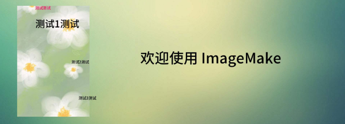
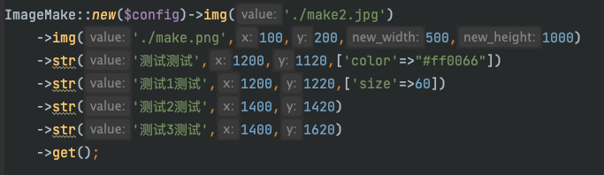

# ImageMake


使用GD库实现多图片与文字的合成处理
* 项目重写，发布为 composer 包方便使用
* 大幅删减和优化，完善的注释上手使用更简单
* 自带思源黑体，可免费商用无需担心版权

### 安装
    composer require saopanda/image-make

### 使用
仅三个方法！支持链式调用，后面调用的会覆盖在前面之上



#### ImageMakeConfig （可选）
提供了一些额外可更改的配置
* 默认透明度开启
* 全局默认字体大小 16，可在`str()`单独设置大小
* 默认第一个调用的`img()`会被作为底图；当设置了底图大小时，此处的优先级更高；只会有一张底图
* 输出格式 `1=>GIF` `2=>JPG` `3=>PNG`，默认`png`
  * ⚠️ 所有待操作图片以及输出格式建议保持统一，可提升图片生成效率
* 默认自带思源黑体，指定其他字体时请使用系统绝对路径，或[参考文档](https://www.php.net/manual/zh/function.imagettftext.php) ->`fontfile`

```php
$config = new ImageMakeConfig();
$config
    ->alpha(true)               //  设置透明度支持
    ->fontSize(20)              //  设置默认字体大小
    ->exportSize(1920, 1080)    //  设置底图大小  
    ->exportType(2)             //  设置输出图片格式
    ->font('/font/abc');        //  设置默认字体
    
ImageMake::new($config)；        //  传入 new()
ImageMake::new()；               //  使用默认设置
```

#### img() 叠加图片
* `$value` 图片路径 或 二进制字符串
* `$x`, `$y` 位置，叠加在底图的哪里，默认左上角 0,0
* `$new_width`, `$new_height` 把这张图拉伸为新宽高，不填为原图大小
* 当此图被作为底图使用时，`$x, $y, $new_width, $new_height `参数无效

```php
public function img(string $value, int $x = 0, int $y = 0, int $new_width = 0, int $new_height = 0)
```

#### str() 叠加文字
* `$value` 要叠加的文字
* `$x`, `$y` 位置，注意：基点在文字左下角，非左上角
* `$config` 配置数组：

```php
[
    'color'    =>  string 支持带透明度的16进制颜色,
    'size'     =>  int 字体大小,
    'wrap'     =>  false | array [
        20, //  int 多少字自动换行
        10  //  int 行高
    ],
    'font'     =>  string 字体路径,
    'deg'      =>  int 旋转角度，设置排列方向，效果：左到右、上到下
]
```

```php
public function str(string $value, int $x = 0, int $y = 10, array $config = [])
```

#### get() 直接输出图片 或 输出图片文件路径
* `$filepath` 指定输出的相对路径 + 文件名，否则直接输出图像

```php
public function get(string $filepath = null)
```

#### demo
见 `./test/test.php`

快速启动测试
```
cd ./test/
php -S localhost:8080
```

### 其他
* 思源黑体 https://github.com/adobe-fonts/source-han-sans/tree/release
* GD 和图像处理 函数 https://www.php.net/manual/zh/ref.image.php