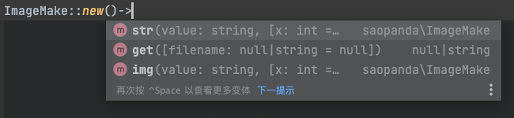

# imageManage
使用GD库实现多图片与文字的合成处理
* 项目重写，发布为 composer 包方便使用
* 大幅删减和优化，完善的注释上手使用更简单
* 自带思源黑体，可免费商用

### 安装
    composer require saopanda/image-make

### 使用
仅三个方法！支持链式调用，越靠后调用的层级越高，会覆盖在前面的层级上


```php
ImageMake::new($config)->img('./make2.jpg')
    ->img('./make.png',100,200,500,1000)
    ->str('测试测试',1200,1120,['size'  =>  60,'color'=>"#ff0066"])
    ->str('测试1测试',1200,1220,['size'  =>  60,'color'=>"#ff4566"])
    ->str('测试2测试',1400,1420,['size'  =>  60])
    ->str('测试3测试',1400,1620,['size'  =>  60])
    ->get();
```

#### 底图
* 通过 `ImageMakeConfig->exportSize()` 指定了输出图片的大小时，会自动创建该尺寸的空底图
* 第一个链式调用的 `img()` 会被自动设为底图
* 只会创建一次底图，`ImageMakeConfig` 设置的优先级更高 

#### ImageMakeConfig （可选）
提供了一些额外可更改的配置
```php
$config = new ImageMakeConfig();
$config
    ->alpha(true)               //  设置透明度支持     默认 true
    ->exportSize('1920','1080') //  设置底图大小      默认第一个 img()为底图
    ->exportType(2)             //  设置输出图片格式    默认 png
    ->font('/font/abc');        //  设置默认字体      默认 思源黑体
    
ImageMake::new($config)；        //  传入 new()
```

#### img() 叠加图片
* `$value` 图片路径 或 二进制字符串
* `$x`, `$y` 位置，叠加在底图哪里，不填左上角 0,0
* `$new_width`, `$new_height` 把这张图拉伸为新宽高，不填为原图大小
* 当此图被作为底图使用时，`$x, $y, $new_width, $new_height `参数无效
```php
public function img(string $value, int $x = 0, int $y = 0, int $new_width = 0, int $new_height = 0)
```

#### str() 叠加文字
* `$value` 要叠加的文字
* `$x`, `$y` 位置，注意：基点在文字左下角，非左上角
* `$config` 配置数组：
```php
[
    'color'    =>  string 支持带透明度的16进制颜色,
    'size'     =>  int 字体大小,
    'wrap'     =>  false | array [
        20, //  int 多少字自动换行
        10  //  int 行高
    ],
    'font'     =>  string 字体路径,
    'deg'      =>  int 旋转角度，设置排列方向，效果：左到右、上到下
]
```

```php
public function str(string $value, int $x = 0, int $y = 10, array $config = [])
```

#### get() 直接输出图片 或 输出图片文件路径
* `$filename` 指定生成图片文件名，null直接输出图像
```php
public function get(string $filename = null)
```

### 其他
* 思源黑体 https://github.com/adobe-fonts/source-han-sans/tree/release